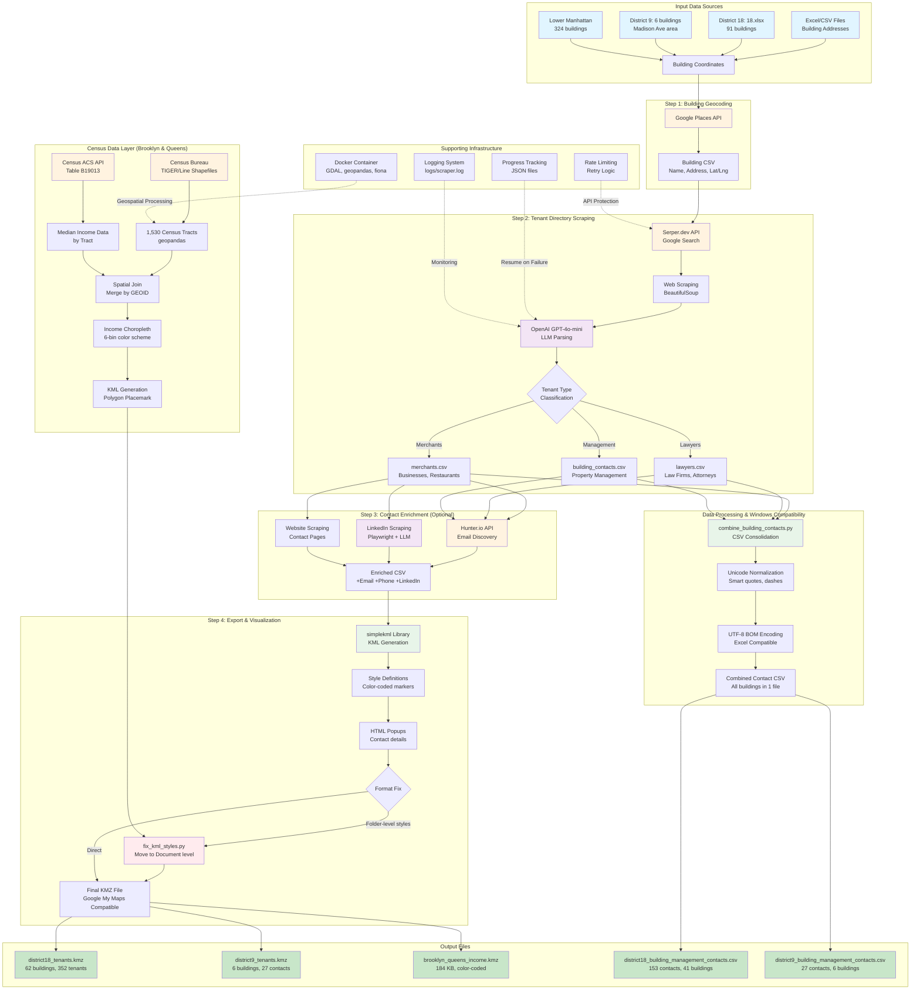

# Company Contact Info Scraper

Automated tool to extract company contact information (websites, emails, phone numbers, social media) from a CSV list using web scraping and LLM parsing.

## Features

### Core Scraping
- 🔍 **Google Places API** integration for official websites
- 🌐 **Intelligent web scraping** with BeautifulSoup
- 🤖 **LLM-powered parsing** using GPT-4o-mini for accurate extraction
- ✅ **Data validation** and quality scoring
- 📊 **Progress tracking** with incremental saves
- 🛡️ **Rate limiting** and retry logic
- 📝 **Comprehensive logging**

### Building Tenant Analysis
- 🏢 **District 18 & 9 Office Buildings** - Complete tenant directory scraping
- 👥 **Building Management Contacts** - Automated extraction and enrichment
- 📍 **Google Maps KMZ Export** - Interactive maps with color-coded markers
- 🗂️ **CSV Consolidation** - Combined contact exports for easy access

### Census Data Visualization
- 🗺️ **Income Choropleth Maps** - Brooklyn & Queens median household income
- 📊 **Census Tract Analysis** - 1,530 tracts with color-coded income levels
- 🎨 **Google My Maps Compatible** - Properly formatted KML/KMZ exports
- 💾 **Windows Excel Compatible** - UTF-8 BOM encoding for all CSV exports

## System Architecture

The following diagram illustrates the complete data pipeline for building contact information scraping, from input Excel files through to final KMZ and CSV outputs:



**Color Legend:**
- 🔵 **Light Blue**: Input data sources
- 🟠 **Orange**: External APIs (Google Places, Serper.dev, Hunter.io, Census Bureau)
- 🟣 **Purple**: AI/LLM processing (OpenAI GPT-4o-mini, LinkedIn extraction)
- 🟢 **Light Green**: Data processing scripts
- 🔴 **Red**: Critical compatibility fixes
- 🟢 **Dark Green**: Final output deliverables

**Key Workflows:**
1. **Building Geocoding** → Converts addresses to GPS coordinates via Google Places API
2. **Tenant Scraping** → Web search → Scraping → LLM parsing → 3-way classification
3. **Contact Enrichment** → Email/phone/LinkedIn discovery via Hunter.io and web scraping
4. **KMZ Export** → KML generation → Style fix → Google My Maps compatible files
5. **Census Overlay** → Demographic income choropleth for Brooklyn & Queens
6. **CSV Consolidation** → Windows-compatible combined contact exports

## Project Structure

```
sy_promotion_merchant_scraper/
├── README.md              # This file
├── PLAN.md               # Detailed project plan
├── requirements.txt      # Python dependencies
├── .env.example         # Environment template
├── config/
│   └── settings.py      # Configuration
├── scrapers/
│   ├── google_places.py # Google Places integration
│   ├── website_scraper.py # Web scraping logic
│   └── llm_parser.py    # OpenAI LLM parser
├── utils/
│   ├── validators.py    # Validation utilities
│   └── logger.py        # Logging setup
├── main.py              # Main script
├── scripts/
│   ├── building_tenants/  # Office building tenant scraping
│   │   ├── district18/    # District 18 (Midtown) scripts
│   │   └── district9/     # District 9 (Madison Ave) scripts
│   ├── census/           # Census data and income mapping
│   ├── pharmacies/       # Pharmacy scraping
│   └── utils/           # Utility scripts
├── data/
│   ├── building_tenants/        # Building tenant data
│   │   ├── tenants/district18/  # District 18 tenant CSVs
│   │   ├── tenants/district9/   # District 9 tenant CSVs
│   │   └── exports/            # Combined CSVs and KMZ files
│   ├── census/                 # Census tract data
│   │   ├── boundaries/         # TIGER/Line shapefiles
│   │   └── exports/           # Income map KMZ files
│   ├── pharmacies/            # Pharmacy data
│   └── district_18/           # District 18 raw data
└── docs/                      # Documentation
```

## Setup

### Option 1: Docker Setup (Recommended)

The easiest way to run this project is using Docker:

```bash
# 1. Configure API keys
cp .env.example .env
nano .env  # Add your OpenAI and Google Places API keys

# 2. Build and run with Docker Compose
docker-compose up --build

# Or run in detached mode
docker-compose up -d

# View logs
docker-compose logs -f

# Stop the container
docker-compose down
```

**Docker Benefits:**
- No Python environment setup needed
- Consistent environment across all machines
- Automatic data persistence via volumes
- Easy to deploy and scale

### Option 2: Local Python Setup

If you prefer to run without Docker:

```bash
# Create virtual environment
python3 -m venv venv
source venv/bin/activate  # On macOS/Linux

# Install requirements
pip install -r requirements.txt
```

### 2. Configure API Keys

```bash
# Copy environment template
cp .env.example .env

# Edit .env and add your API keys
nano .env
```

Required API keys:
- **OpenAI API Key** (Required) - Get from [OpenAI Platform](https://platform.openai.com/)
- **Google Places API Key** (Optional but recommended) - Get from [Google Cloud Console](https://console.cloud.google.com/)

### 3. Prepare Input Data

Place your CSV file in the `data/` directory. Expected columns:
- `Name` - Company name
- `Addr` - Address
- `Phone` - Phone number (optional)
- `Type` - Business type (optional)

## Usage

### Using Docker (Recommended)

**Test with Sample Data (5 companies):**
```bash
docker-compose up
```

**Process All Companies:**

1. Edit `main.py` and change line 260:
   ```python
   scraper.run(limit=5)  # Remove limit
   ```
   to:
   ```python
   scraper.run()  # Process all
   ```

2. Rebuild and run:
   ```bash
   docker-compose up --build
   ```

**Advanced Docker Commands:**
```bash
# Run specific Python command
docker-compose run scraper python main.py

# Interactive shell inside container
docker-compose run scraper /bin/bash

# View real-time logs
docker-compose logs -f scraper

# Remove container and volumes
docker-compose down -v
```

### Using Local Python

**Test with Sample Data (5 companies):**
```bash
python main.py
```

**Process All Companies:**

Edit `main.py` and change:
```python
scraper.run(limit=5)  # Remove limit
```
to:
```python
scraper.run()  # Process all
```

Then run:
```bash
python main.py
```

## Output

The script generates:

1. **output_enriched.csv** - Enriched CSV with:
   - Original company info
   - Website URL
   - Primary and secondary emails
   - Verified phone numbers
   - LinkedIn, Twitter, Facebook profiles
   - Contact person details
   - Quality score (0-100)

2. **progress.json** - Incremental progress tracker (allows resuming)

3. **logs/scraper.log** - Detailed execution logs

## Output Schema

```csv
name, type, website, email, email_secondary, phone, phone_secondary,
address, linkedin, twitter, facebook, contact_person, contact_title,
stars, reviews, quality_score, data_source, last_updated
```

## How It Works

```
Input CSV → Google Places API → Website Scraper → LLM Parser → Validation → Output CSV
```

1. **Google Places API**: Gets official website and verified phone
2. **Website Scraper**: Finds and scrapes contact pages
3. **LLM Parser**: Extracts structured contact info from HTML
4. **Validation**: Verifies email/phone formats, calculates quality score
5. **Output**: Saves enriched data to CSV

## Quality Scoring

Each company gets a score (0-100) based on:
- Website found: +30 points
- Email found: +25 points
- Phone verified: +20 points
- LinkedIn found: +15 points
- Contact person found: +10 points

## Cost Estimation

For 68 companies:
- **Google Places API**: $0 (free tier)
- **OpenAI API**: ~$0.50-$1.00 (GPT-4o-mini)
- **Total**: < $2

## Troubleshooting

### Docker Issues

**"docker: command not found"**
- Install Docker Desktop from [docker.com](https://www.docker.com/products/docker-desktop)

**"Cannot connect to Docker daemon"**
- Ensure Docker Desktop is running

**"Port already in use"**
- The scraper doesn't expose ports by default
- If you modified docker-compose.yml, change the port mapping

**Rebuild after code changes:**
```bash
docker-compose up --build
```

### Common Issues

**"No module named 'googlemaps'"**
```bash
# If using local Python:
pip install -r requirements.txt

# If using Docker:
docker-compose up --build
```

**"OpenAI API key is required"**
- Add your API key to `.env` file
- If using Docker, restart: `docker-compose restart`

**"Rate limit exceeded"**
- The script has built-in rate limiting
- Check your API quotas

**"No results found"**
- Some companies may not have public websites
- Check Google Places availability for that business

### Resume After Interruption

The script automatically saves progress to `data/progress.json`. If interrupted, simply run again and it will skip already processed companies.

**With Docker:**
```bash
docker-compose up  # Will resume from where it stopped
```

## Configuration

Edit `config/settings.py` to customize:
- Rate limiting settings
- Retry logic
- LLM model and parameters
- Quality score weights
- Logging level

## Examples

### Successful Output Example

```
Processing: Bluestone Lane 330 Madison Avenue
✓ Found website: https://bluestonelane.com
✓ Successfully scraped website
✓ LLM parsing successful
  Email: contact@bluestonelane.com
  Phone: (212) 555-1234
  LinkedIn: https://linkedin.com/company/bluestone-lane
Quality Score: 85/100
```

## Best Practices

- ✅ Start with test run (5 companies)
- ✅ Check logs for errors
- ✅ Verify output quality before full batch
- ✅ Respect rate limits (built-in)
- ✅ Monitor API costs in OpenAI dashboard
- ✅ Keep API keys secure (never commit .env)

## Contributing

For bugs or improvements, please open an issue or submit a pull request.

## License

MIT License - See LICENSE file for details

## Support

For questions or issues:
1. Check logs in `logs/scraper.log`
2. Review `PLAN.md` for technical details
3. Verify API keys and quotas

---

## Scripts Reference

### Pharmacy Scraping

#### `scripts/pharmacies/scrape_all_pharmacies.py`
**Purpose**: Scrape all NYC pharmacies using Google Places API
**Output**: `data/pharmacies/pharmacy_results.csv`
**Run**: `docker-compose run --rm scraper python scripts/pharmacies/scrape_all_pharmacies.py`
**Notes**: Main pharmacy scraper, uses Google Places API + web scraping for contact details

#### `scripts/pharmacies/scrape_pharmacies_area9.py`
**Purpose**: Scrape pharmacies in specific geographic area (Area 9)
**Output**: `data/pharmacies/area9_pharmacies.csv`
**Run**: `docker-compose run --rm scraper python scripts/pharmacies/scrape_pharmacies_area9.py`
**Notes**: Specialized script for testing specific area boundaries

#### `scripts/pharmacies/export_pharmacies_to_kmz.py`
**Purpose**: Convert pharmacy CSV data to KML/KMZ format for Google Maps
**Input**: `data/pharmacies/pharmacy_results.csv`
**Output**: `data/pharmacies/exports/pharmacies.kml`, `data/pharmacies/exports/pharmacies.kmz`
**Run**: `python3 scripts/pharmacies/export_pharmacies_to_kmz.py`
**Notes**: Creates interactive map with pharmacy markers and contact popups

---

### Building Tenant Scraping (Lower Manhattan Office Buildings)

#### Complete 4-Step Workflow

**Step 1: Get Building Coordinates**
```bash
docker-compose run --rm scraper python scripts/building_tenants/01_scrape_office_buildings.py
```
- **Purpose**: Scrape office building coordinates in Lower Manhattan
- **Output**: `data/building_tenants/buildings/lower_manhattan_office_buildings.csv`
- **Notes**: Uses Google Places API to find ~324 office buildings

**Step 2: Scrape Tenant Directories**
```bash
docker-compose run --rm scraper python scripts/building_tenants/02_scrape_tenant_directories.py
```
- **Purpose**: Extract tenant directories from each building
- **Output**: Creates 3 CSV files per building in `data/building_tenants/tenants/lower_manhattan/`:
  - `{building}_merchants.csv` - Businesses/merchants
  - `{building}_lawyers.csv` - Law firms and attorneys
  - `{building}_building_contacts.csv` - Building management
- **Notes**: Uses Hunter.io API + LLM parsing; processes all 324 buildings

**Step 3: Enrich Contact Data** (Optional but recommended)
```bash
docker-compose run --rm scraper python scripts/building_tenants/03_enrich_contacts.py
```
- **Purpose**: Enrich buildings with missing contact info (emails, phones, LinkedIn)
- **Input**: Existing CSV files in `data/building_tenants/tenants/lower_manhattan/`
- **Output**: Updates all `*_merchants.csv`, `*_lawyers.csv`, `*_building_contacts.csv`
- **Duration**: 6-8 hours for 25 buildings (~20-30 sec per tenant)
- **Method**: Serper.dev API (Google Search) → Web scraping → OpenAI LLM extraction
- **Progress**: Saved to `data/building_tenants/progress/enrichment_progress.json` (can resume if interrupted)
- **Options**:
  - `--top-n 25` - Enrich top N buildings by tenant count
  - `--buildings-file path/to/file.txt` - Enrich specific buildings from file

**Step 4: Generate Google Maps KMZ**
```bash
python3 scripts/building_tenants/04_export_to_kmz.py
```
- **Purpose**: Create KMZ file with all enriched tenant data
- **Input**:
  - `data/building_tenants/buildings/lower_manhattan_office_buildings.csv`
  - All tenant CSV files from `data/building_tenants/tenants/lower_manhattan/`
- **Output**:
  - `data/building_tenants/exports/lower_manhattan_tenants.kml`
  - `data/building_tenants/exports/lower_manhattan_tenants.kmz` (upload this)
- **Upload to**: https://mymaps.google.com
- **Features**: Color-coded markers by tenant density, interactive popups with full contact details

**District 9 Special Export**
```bash
# Get District 9 building coordinates
python3 scripts/building_tenants/district9_get_coordinates.py

# Export District 9 to KMZ (with building management prominently displayed)
python3 scripts/building_tenants/district9_export_to_kmz.py
```
- **Output**: `data/building_tenants/exports/district9_tenants.kmz`
- **Buildings**: 6 premium buildings (330 Madison, 1221 6th Ave, 477/485/488 Madison, 499 Park)
- **Features**: Building management contacts displayed first, enriched tenant data

**District 18 Building Tenant Scraper**
```bash
# Step 1: Convert Excel to building CSV
docker-compose run --rm scraper python scripts/building_tenants/district18/01_convert_excel_to_buildings.py

# Step 2: Scrape tenant directories
docker-compose run --rm scraper python scripts/building_tenants/district18/02_scrape_tenant_directories.py

# Step 3: Enrich contacts (optional but recommended)
docker-compose run --rm scraper python scripts/building_tenants/district18/03_enrich_contacts.py

# Step 4: Generate Google Maps KMZ
python3 scripts/building_tenants/district18/04_export_to_kmz.py
```
- **Input**: `data/district_18/18.xlsx` - Excel file with building addresses
- **Output**: 
  - `data/building_tenants/buildings/district18_buildings.csv` - Building coordinates
  - `data/building_tenants/tenants/district18/{building}_merchants.csv` - Tenant data
  - `data/building_tenants/exports/district18_tenants.kmz` - Google Maps file
- **Buildings**: 91 buildings in District 18 (Midtown Manhattan)
- **Features**: Same 4-step workflow as Lower Manhattan, adapted for District 18 data structure
- **Results**: 62 buildings with tenant data, 352 total tenants extracted

---

### Data Processing & Utilities

#### `scripts/utils/consolidate_results.py`
**Purpose**: Merge multiple CSV result files into single consolidated file
**Run**: `python3 scripts/utils/consolidate_results.py`

#### `scripts/utils/parse_districts.py`
**Purpose**: Parse and process NYC district geographic boundaries
**Run**: `python3 scripts/utils/parse_districts.py`
**Notes**: Used for area-based pharmacy scraping

#### `scripts/utils/manage_cache.py`
**Purpose**: Manage API response cache to reduce costs
**Run**: `python3 scripts/utils/manage_cache.py [stats|clear|view]`
**Notes**: Cache responses to avoid duplicate API calls

#### `scripts/utils/populate_cache_from_csv.py`
**Purpose**: Pre-populate cache from existing CSV data
**Run**: `python3 scripts/utils/populate_cache_from_csv.py`
**Notes**: Bootstrap cache from previous scraping runs

---

## Environment Variables

Required API keys (set in `.env` file):

```bash
# Required for all scripts
OPENAI_API_KEY=your_key_here           # OpenAI for LLM parsing
GOOGLE_PLACES_API_KEY=your_key_here    # Google Places API

# Required for enrichment (Step 3)
SERPER_API_KEY=your_key_here           # Serper.dev for Google Search
HUNTER_API_KEY=your_key_here           # Hunter.io for email finding
```

---

## Data Output Structure

### Building Tenants: `data/building_tenants/`

**Building Coordinates**:
- `buildings/lower_manhattan_office_buildings.csv` - ~324 office buildings
- `buildings/district9_buildings.csv` - 6 District 9 premium buildings
- `buildings/district18_buildings.csv` - 91 District 18 buildings

**Tenant Data** (per building):
- `tenants/lower_manhattan/{building}_merchants.csv` - Merchants and businesses
- `tenants/lower_manhattan/{building}_lawyers.csv` - Law firms and attorneys
- `tenants/lower_manhattan/{building}_building_contacts.csv` - Building management
- `tenants/district9/{building}_merchants.csv` - District 9 merchants
- `tenants/district9/{building}_lawyers.csv` - District 9 lawyers
- `tenants/district9/{building}_building_contacts.csv` - District 9 building mgmt
- `tenants/district18/{building}_merchants.csv` - District 18 merchants
- `tenants/district18/{building}_lawyers.csv` - District 18 lawyers
- `tenants/district18/{building}_building_contacts.csv` - District 18 building mgmt

**Exports**:
- `exports/lower_manhattan_tenants.kml` - KML for Google Maps
- `exports/lower_manhattan_tenants.kmz` - Compressed KML (final deliverable)
- `exports/district9_tenants.kml` - District 9 KML
- `exports/district9_tenants.kmz` - District 9 compressed KML
- `exports/district18_tenants.kml` - District 18 KML
- `exports/district18_tenants.kmz` - District 18 compressed KML

**Progress Files**:
- `progress/enrichment_progress.json` - Lower Manhattan enrichment progress (allows resume)
- `progress/district18_enrichment_progress.json` - District 18 enrichment progress (allows resume)
- `progress/targeted_buildings_51.txt` - List of buildings for targeted enrichment
- `scraping_coverage_report_district18.csv` - District 18 scraping coverage report

### Pharmacies: `data/pharmacies/`

- `pharmacy_results.csv` - All NYC pharmacies
- `area9_pharmacies.csv` - Area 9 pharmacies
- `exports/pharmacies.kml` - KML for Google Maps
- `exports/pharmacies.kmz` - Compressed KML

---

## CSV Output Schema

### Merchants CSV
```
name, type, is_law_firm, website, email, email_secondary, phone, phone_secondary,
address, linkedin, twitter, facebook, instagram, contact_person, contact_title,
stars, reviews, quality_score, data_source, last_updated
```

### Lawyers CSV
```
lawyer_name, lawyer_title, company_name, lawyer_email, lawyer_phone,
lawyer_linkedin, practice_areas, bar_admissions, years_experience,
address, quality_score, data_source, last_updated
```

### Building Contacts CSV
```
building_name, name, contact_name, contact_title, email, phone, website,
address, company_type, quality_score, data_source, last_updated
```

---

## Common Command Patterns

### Full Building Tenant Pipeline
```bash
# 1. Get building coordinates
docker-compose run --rm scraper python scripts/building_tenants/01_scrape_office_buildings.py

# 2. Scrape tenant directories (all 324 buildings)
docker-compose run --rm scraper python scripts/building_tenants/02_scrape_tenant_directories.py

# 3. Enrich buildings with contact data (6-8 hours)
docker-compose run --rm scraper python scripts/building_tenants/03_enrich_contacts.py

# 4. Generate KMZ file
python3 scripts/building_tenants/04_export_to_kmz.py
```

### District 9 Premium Buildings Pipeline
```bash
# Get building coordinates
python3 scripts/building_tenants/district9_get_coordinates.py

# Export to KMZ
python3 scripts/building_tenants/district9_export_to_kmz.py
```

### District 18 Building Tenants Pipeline
```bash
# Step 1: Convert Excel to building CSV
docker-compose run --rm scraper python scripts/building_tenants/district18/01_convert_excel_to_buildings.py

# Step 2: Scrape tenant directories (all 91 buildings)
docker-compose run --rm scraper python scripts/building_tenants/district18/02_scrape_tenant_directories.py

# Step 3: Enrich contacts (optional, top 25 buildings)
docker-compose run --rm scraper python scripts/building_tenants/district18/03_enrich_contacts.py

# Step 4: Generate KMZ file
python3 scripts/building_tenants/district18/04_export_to_kmz.py
```

### Pharmacy Pipeline
```bash
# Scrape all NYC pharmacies
docker-compose run --rm scraper python scripts/pharmacies/scrape_all_pharmacies.py

# Convert to KMZ
python3 scripts/pharmacies/export_pharmacies_to_kmz.py
```

### Cache Management
```bash
# View cache stats
python3 scripts/utils/manage_cache.py stats

# Clear cache
python3 scripts/utils/manage_cache.py clear

# Pre-populate from CSV
python3 scripts/utils/populate_cache_from_csv.py
```

---

**Last Updated:** November 27, 2024
**Version:** 3.1 - Added District 18 building tenant scraper
